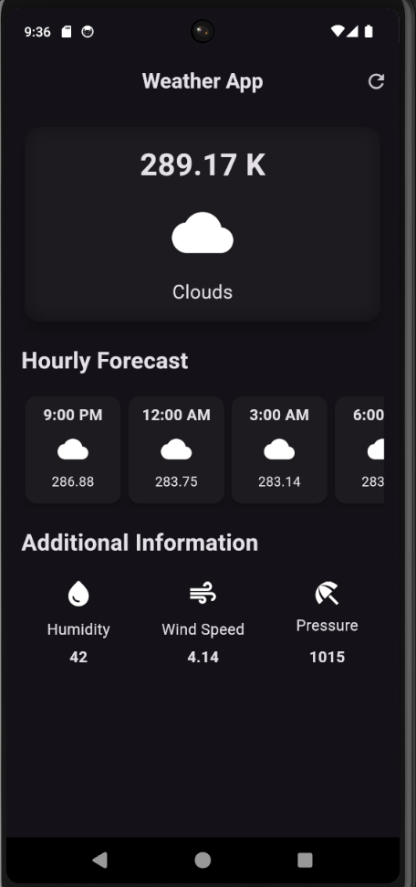

# Weather App

A Flutter-based weather application that displays current weather information including temperature, sky condition, and additional information such as humidity and wind speed.

## Features

- Fetches real-time weather data using OpenWeatherMap API.
- Displays temperature, weather condition, and additional details.
- User-friendly interface with weather icons and descriptive text.


## Getting Started

### Prerequisites

- Flutter SDK
- A code editor (VS Code, Android Studio, etc.)
- An OpenWeatherMap API key

### Installation

1. Clone the repository:
   ```sh
   git clone https://github.com/your-username/weather_app.git
   cd weather_app

2. Install dependencies:

    flutter pub get


3. Run the app:

    flutter run


### Usage
1. Ensure you have Flutter installed and set up on your machine.
2. Obtain an API key from OpenWeatherMap.
3. Replace the API_KEY in the code with your actual API key.
4. Run the app on an emulator or a physical device.



